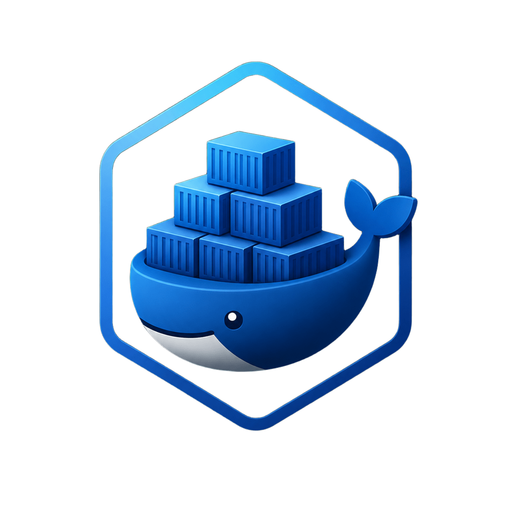

<div align="center">



# DockLite

### Lightweight Docker Desktop Manager for Linux


</div>

---

## About DockLite

DockLite is a lightweight Docker desktop manager for Linux built with Python and PySide6.

It gives developers a clean graphical interface to manage Docker containers without needing to use the terminal for basic tasks.

DockLite focuses on being simple, fast, native-looking, and less heavy than large Electron-based Docker GUI tools.
A lightweight Docker desktop manager for Linux built with Python and Qt.


---
## Preview
<iframe width="800" height="450"
src="https://youtu.be/dqL5DM6Fdrw"
frameborder="0"
allowfullscreen>
</iframe>

---
## Features

- View all Docker containers
- Start containers
- Stop containers
- Restart containers
- Delete containers
- Live container logs
- Real-time CPU and memory stats
- Dark modern UI
- Lightweight and fast

---

## Tech Stack

- Python
- PySide6 (Qt for Python)
- Docker SDK for Python

---

## Installation

### 1. Clone the repository

```bash
git clone https://github.com/yaselmo/DockLite.git
cd DockLite
```

### 2. Create virtual environment

```bash
python -m venv .venv
```

### 3. Activate virtual environment

#### Linux / macOS

```bash
source .venv/bin/activate
```

#### Windows

```bash
.venv\Scripts\activate
```

### 4. Install dependencies

```bash
pip install -r requirements.txt
```

---

## Run the application

```bash
python main.py
```

---

## Project Structure

```bash
DockLite/
│
├── docklite/
│   ├── app.py
│   ├── docker_service.py
│   ├── styles.py
│   └── __init__.py
│
├── main.py
├── requirements.txt
├── LICENSE
└── README.md
```

---

## Requirements

- Python 3.10+
- Docker installed and running
- Linux system

---

## Planned Features

- Container creation
- Docker Compose support
- Image management
- Container terminal access
- Search and filtering
- Notifications
- System tray support
- Resource graphs
- Multi-host support

---

## Why DockLite?

Most Docker GUI tools are heavy, slow, or Electron-based.

DockLite focuses on:

- simplicity
- speed
- native Linux desktop experience
- lightweight resource usage

---

## License

GNU General Public License v3.0 (GPL-3.0)

---

## Author

Yasser El Mouatadir

GitHub: https://github.com/yaselmo